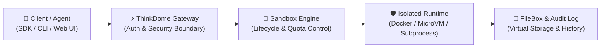
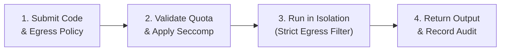
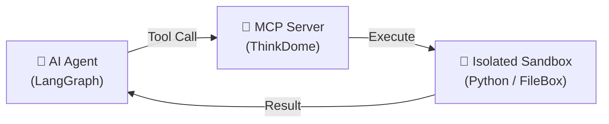

<div align="center">

# ThinkDome

### Secure, isolated multi-backend code execution sandbox and tool orchestrator for autonomous AI agents and applications.

[](https://www.python.org/downloads/)
[](LICENSE)
[](https://colab.research.google.com/github/abeldirectory252/ThinkDome/blob/main/ThinkDome_Colab_Quickstart.ipynb)
[](https://kaggle.com/kernels/welcome?src=https://github.com/abeldirectory252/ThinkDome/blob/main/ThinkDome_Colab_Quickstart.ipynb)

<p align="center">
  
</p>

</div>

---

## 📌 Overview

**ThinkDome** is a multi-backend code execution sandbox, security boundary, and agent orchestration platform designed for **autonomous AI agents, LLM applications, and multi-tenant workloads**.

It provides multiple execution backends ranging from fast process sandboxes to hardware-virtualized MicroVMs and user-space kernels (`gVisor`), allowing applications to safely run untrusted or dynamically generated code inside strictly controlled environments.

Key capabilities include:
* 🐍 **Python SDK** for programmatic sandbox execution and agent tool calling
* 💻 **Dual CLI Tools** (`thinkdome` for sandboxes, `think` for site & multi-tenancy administration)
* 🌐 **Modern Web Dashboard** with real-time dynamic UI builder and interactive terminal
* 🛡️ **Defense-in-Depth Security**: Seccomp syscall filtering, Linux capability dropping, and read-only roots
* 🌐 **Strict Egress Policies**: Default-deny network model with explicit domain allowlisting
* 📂 **FileBox Virtual Filesystem**: Isolated per-user / per-sandbox file persistence
* 🤖 **Model Context Protocol (MCP)**: Native tools for LLM agent integration (LangGraph, AutoGen, Telegram)
* 🏢 **Multi-Tenant Site Management**: Tenant database isolation, backup/restore workflows, and migrations

---

## 🏗️ How ThinkDome Works

### 1. Architecture Flow



### 2. Execution Pipeline



### 3. Agent & MCP Tool Flow



---

## ⚡ Execution Backends

| Backend | Technology | Isolation Level | Typical Use Case |
| :--- | :--- | :--- | :--- |
| **`microvm`** | Firecracker / Cloud Hypervisor | Hardware KVM Virtualization | Maximum isolation for multi-tenant production |
| **`gvisor`** | gVisor (`runsc`) | User-space Kernel Isolation | Untrusted code execution & zero-day defense |
| **`kata`** | Kata Containers | Lightweight VM Isolation | Strong isolation with OCI container compatibility |
| **`docker`** | Docker + cgroups v2 + seccomp | Linux OS Container Isolation | General purpose agent workloads & custom packages |
| **`subprocess`** | Subprocess Sandbox | Lightweight Process Isolation | Fast local development, rapid test suites |

---

## 🚀 Quick Start

### 1. Installation

Install directly from GitHub:
```bash
pip install git+https://github.com/abeldirectory252/ThinkDome.git
```

Or clone for local development:
```bash
git clone https://github.com/abeldirectory252/ThinkDome.git
cd ThinkDome
python3 -m venv venv
source venv/bin/activate
pip install -e .
```

### 2. Verify Your Environment

Run the automated diagnostic tool to check Docker, KVM, and system bounds:
```bash
thinkdome check
```

### 3. Run Code with the CLI

Execute Python code in an isolated sandbox with a single command:
```bash
# Lightweight subprocess execution
thinkdome run 'print("Hello from ThinkDome!")' --backend subprocess

# Containerized Docker execution with resource limits
thinkdome run 'import sys; print("Python:", sys.version)' \
  --backend docker \
  --memory 512M \
  --timeout 30
```

### 4. Launch the Web Console & API Server

```bash
think serve --host 0.0.0.0 --port 8000
```
Open **`http://localhost:8000`** in your browser to access the dynamic dashboard, interactive terminal, and FileBox explorer.

---

## 🐍 Python SDK

Use ThinkDome directly inside your Python applications and AI agents:

```python
from thinkdome import Sandbox

# Run inside locked-down Docker container
with Sandbox(backend="docker", memory_limit="512M", timeout=15) as dome:
    # Write a dataset into the isolated sandbox workspace
    dome.write_file("data.csv", "name,score\nAlice,95\nBob,88\n")
    
    # Run code that reads the data
    result = dome.run("""
import pandas as pd
df = pd.read_csv("data.csv")
print("Average score:", df["score"].mean())
""")
    
    print("Success:", result.success)
    print("Output:", result.output.strip())
```

### Strict Network Egress Control

```python
from thinkdome import Sandbox
from thinkdome.sandbox.network import EgressRule

# Default-deny: only allow specific domains
with Sandbox(
    backend="docker",
    allow_network=True,
    egress_rules=[
        EgressRule(domain="api.github.com", action="allow", ports=[443]),
        EgressRule(domain="huggingface.co", action="allow", ports=[443]),
    ]
) as dome:
    result = dome.run("""
import urllib.request
res = urllib.request.urlopen("https://api.github.com")
print("Status:", res.status)
""")
    print(result.output)
```

---

## 🧰 Multi-Tenant Site Administration (`think`)

ThinkDome features an enterprise site management CLI for multi-tenant deployments:

```bash
# Create a timestamped backup of database and files
think --site my-tenant backup

# Restore a tenant database from backup
think --site my-tenant restore /path/to/backup.sql.gz

# Manage site administrator credentials
think --site my-tenant set-admin-password

# Run database migrations
think migrate

# Launch interactive Python console with site context
think --site my-tenant console
```

---

## 📖 Documentation Hub

Explore the complete ThinkDome documentation in the [`/docs`](docs/README.md) directory:

| Document | Description |
| :--- | :--- |
| **[Documentation Hub](docs/README.md)** | Sitemap, architecture overview, and index |
| **[Architecture Guide](docs/architecture/ARCHITECTURE.md)** | Deep-dive into internal layers, RPC dispatcher, and Mermaid diagrams |
| **[Getting Started Guide](docs/guides/GETTING_STARTED.md)** | Step-by-step setup, configuration, CLI reference, and troubleshooting |
| **[API Reference](docs/api/API_REFERENCE.md)** | REST endpoints, WebSocket streaming, MCP tool schemas, and SDK reference |
| **[Commit History & Changelog](docs/changelog/COMMIT_HISTORY.md)** | Full 94-commit chronological history and release notes |
| **[Docker Isolation](docs/isolation/docker.md)** | Deep dive into Docker security configurations and cgroups |
| **[Hypervisor Setup Guide](docs/example/hypervisor_setup_guide.md)** | Guide for KVM, Firecracker, and MicroVM deployments |
| **[LangGraph Integration](docs/integrations/langgraph.md)** | State checkpoints, agent memory, and sandbox coordination |

---

## 💬 Community & Support

* **Author:** Abel Yohannes
* **GitHub:** [@abelyo252](https://github.com/abeldirectory252/)
* **Telegram:** [@i_am_abel](https://t.me/i_am_abel)

---

## 📜 License

Distributed under the **MIT License**. See [LICENSE](LICENSE) for more information.
