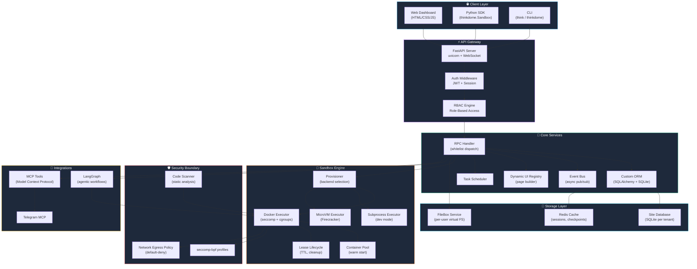
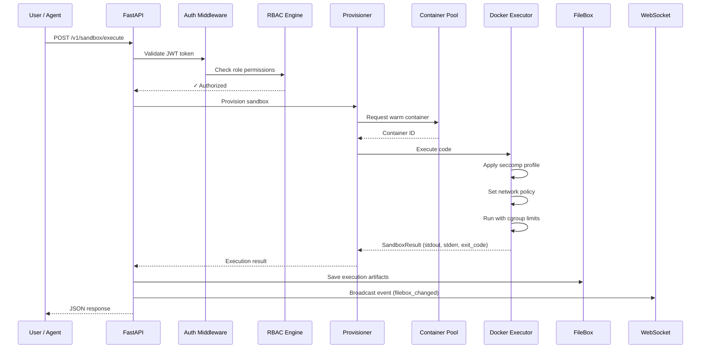
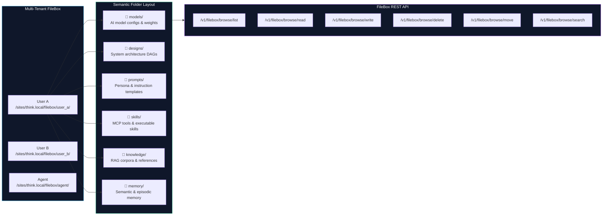
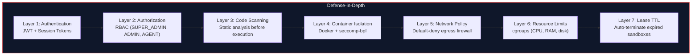

# ThinkDome — Architecture Overview

> Technical architecture documentation for the ThinkDome secure AI agent sandbox & orchestration platform.

---

## System Architecture Diagram



---

## Request Flow — Code Execution



---

## FileBox Virtual Filesystem



---

## Security Model



---

## Module Directory Map

```
thinkdome/
├── __init__.py          # Public API: Sandbox, whitelist, call
├── cli.py               # CLI entry point (thinkdome command)
├── api/                 # FastAPI server, routes, middleware
│   ├── server.py        # Application factory & route registration
│   └── routes/          # REST endpoint modules
├── core/                # Framework internals
│   ├── config.py        # Settings & environment resolution
│   ├── handler.py       # RPC whitelist dispatch engine
│   ├── orm/             # Custom ORM (SQLAlchemy models)
│   ├── kernel/          # Startup, migrations, lifecycle
│   ├── events/          # Async event bus
│   ├── ui/              # Dynamic page registry & builder
│   └── middleware/      # CORS, auth, error handling
├── sandbox/             # Sandbox execution engine
│   ├── core/            # Sandbox primitives
│   ├── executors/       # Docker, subprocess, MicroVM backends
│   ├── pool/            # Warm container pool manager
│   ├── security/        # seccomp profiles, network policies
│   ├── sessions/        # Session state management
│   ├── snapshots/       # Checkpoint/restore support
│   └── tools/           # MCP tool bindings
├── security/            # Authentication & authorization
│   ├── auth/            # JWT, session, password hashing
│   ├── identity/        # User identity resolution
│   ├── rbac/            # Role-based access control
│   └── scanner/         # Static code analysis
├── filebox/             # Virtual filesystem service
│   ├── api.py           # Browse REST endpoints
│   ├── core.py          # Read/write/move/delete operations
│   ├── search.py        # Full-text file search
│   └── permissions.py   # Per-file access control
├── control_plane/       # Distributed node management
│   ├── orchestrator.py  # Multi-node orchestration
│   ├── node_agent.py    # Per-node sandbox agent
│   ├── placement.py     # Scheduling & placement
│   └── registry.py      # Node registry
├── integrations/        # External framework connectors
│   └── langgraph.py     # LangGraph agentic workflow integration
├── platform/            # Infrastructure services
│   ├── database/        # Connection pools & migrations
│   ├── storage/         # FileBox storage backend
│   ├── orchestration/   # Container orchestration
│   └── observability/   # Logging & metrics
└── static/              # Frontend assets
    └── assets/
        ├── css/styles.css
        └── js/
            ├── app.js           # SPA router & navigation
            ├── api.js           # REST API client
            ├── filemanager.js   # FileBox workstation UI
            └── ui_builder.js    # Dynamic page renderer
```

---

## Technology Stack

| Layer | Technology |
|-------|-----------|
| **Language** | Python 3.9+ |
| **Web Framework** | FastAPI + Uvicorn |
| **ORM** | SQLAlchemy 2.0 |
| **Database** | SQLite (per-site), Redis |
| **Container Runtime** | Docker Engine |
| **MicroVM** | Firecracker |
| **Auth** | JWT + bcrypt |
| **Frontend** | Vanilla HTML/CSS/JS (SPA) |
| **Real-time** | WebSocket (native) |
| **AI Frameworks** | LangGraph, MCP |
| **Package** | Hatchling (pyproject.toml) |
