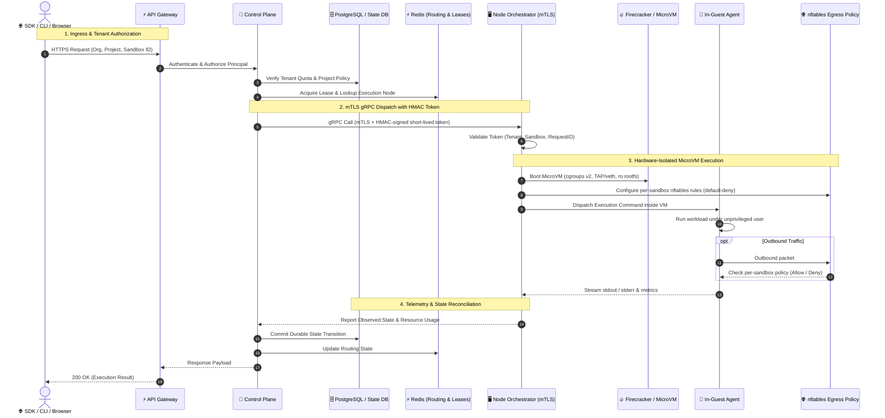
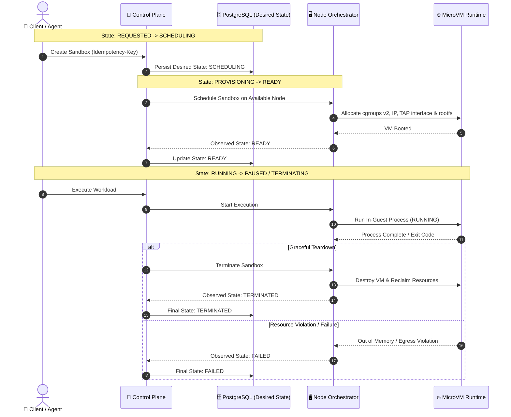

# Multi-Tenant, Multi-Node Sandbox Architecture

## Status

This is the target architecture for ThinkDome production deployments. Docker execution remains a local-development compatibility backend during the migration; hardware-virtualized MicroVMs provide the production isolation boundary.

---

## Design Goals

- **Hostile by Default**: Treat all sandbox code as hostile, including code produced by authenticated AI agents.
- **Unprivileged API**: Keep public API processes unprivileged and unable to control a host runtime directly.
- **Multi-Tenant Scale**: Support multiple organizations, projects, execution nodes, templates, and regions.
- **Durable Lifecycle**: Make lifecycle operations durable, idempotent, auditable, and safe to retry.
- **Hardware Isolation**: Give each sandbox a hardware-isolated runtime, bounded resources, explicit egress policy, and independently revocable credentials.

---

## Target Topology & Dispatch Flow

The following sequence diagram details how incoming requests flow through the control plane, database, cache, and node orchestrators down to the hardware-isolated MicroVM:

The API schedules and authorizes work; it must not mount a Docker socket, own TAP devices, create cgroups, or start VM processes. The node orchestrator is the only privileged component and accepts a narrow, authenticated RPC contract.

Node-agent transport uses two independent controls:

1. **mTLS**: Authenticates the control-plane and node identities on a private network (`NODE_TLS_CERTFILE`, `NODE_TLS_KEYFILE`, and `NODE_TLS_CAFILE`).
2. **HMAC Tokens**: Each request carries an HMAC-signed, short-lived authorization token bound to one organization, project, sandbox, operation, and request ID.

---

## Isolation Model

Production sandboxes run one MicroVM per tenant sandbox. Each VM receives:

- A read-only, versioned template root filesystem.
- An ephemeral copy-on-write disk or a separately attached tenant volume.
- A distinct **cgroups v2** subtree with CPU, memory, PIDs, IO, and wall-clock limits.
- A distinct network namespace and TAP/veth attachment.
- No inbound access except through an authenticated node proxy.
- **Default-deny egress** enforced on the host node via `nftables`, not merely environment proxy variables.
- Short-lived, audience-bound execution credentials delivered only to the in-guest agent when explicitly requested.

---

## Tenant and Authorization Model

Every mutable resource is strictly scoped in a hierarchical tree:

$$\text{Organization} \longrightarrow \text{Project} \longrightarrow \text{Sandbox} \longrightarrow \text{Execution / Volume / Snapshot}$$

The control plane authenticates a principal, authorizes it against the project, and mints a short-lived orchestration request token containing:
- Tenant & Project IDs
- Sandbox ID & Target Operation
- Resource Limits (RAM, CPU, TTL)
- Cryptographic Expiration Timestamp

The node orchestrator validates this token and immediately rejects requests outside its assigned sandbox. No API keys, database credentials, Docker socket permissions, or control-plane service tokens are ever injected into a sandbox.

---

## Durable Lifecycle & State Machine

PostgreSQL is the source of truth for desired lifecycle state. Redis holds leased, reconstructible runtime routing state. Operations use an idempotency key and optimistic concurrency versioning so retries cannot create duplicate sandboxes.

The orchestrator continuously reports observed state. The control plane reconciles desired and observed state, ensuring resilient recovery across node disruptions.

---

## Node Orchestration Contract

The RPC surface exposed by node orchestrators is intentionally minimal:

| RPC Method | Parameters | Description |
|---|---|---|
| `RegisterNode` / `Heartbeat` | `NodeCapacity`, `Health` | Registers node capacity and heartbeats with control plane |
| `CreateSandbox` | `SandboxID`, `Limits`, `Image` | Provisions MicroVM, TAP device, and cgroups v2 limits |
| `Execute` | `Command`, `Env`, `Timeout` | Spawns process inside in-guest execution agent |
| `PauseSandbox` / `ResumeSandbox` | `SandboxID` | Freezes/unfreezes cgroups v2 process tree |
| `TerminateSandbox` | `SandboxID` | Shuts down VM, reclaims network tap, and purges CoW disk |
| `GetSandboxStatus` | `SandboxID` | Returns active resource metrics, process status, and errors |

Every request includes a sandbox ID, idempotency key, deadline, and signed authorization context. The execution agent handles process, file, and stream operations inside the VM; it is not a general host command channel.

---

## Migration Stages

1. **Safety Baseline**: Eliminate host workspace binds and insecure runtime fallback; tighten deployment configuration; make execution failures typed.
2. **Control-Plane Contract**: Persist tenant/project/sandbox records and add idempotent lifecycle operations plus node leases.
3. **Node Orchestrator**: Introduce an authenticated node service and move Docker/MicroVM privilege out of the API process.
4. **MicroVM Data Plane**: Make the existing MicroVM implementation a node-local backend with cgroups, network, image/template, and agent support.
5. **Scale Features**: Placement, snapshots, durable volumes, ingress/egress routing, quotas, audit/event streams, and multi-region scheduling.

---

## Non-Negotiable Production Invariants

- No public API or worker container mounts `/var/run/docker.sock`.
- No sandbox uses a host-path bind mount.
- No automatic fallback can reduce the requested isolation level.
- Production image references are immutable digests, not mutable tags.
- All node-control traffic uses mTLS and operation-scoped authorization.
- Tenant ownership is checked at every resource boundary.
- Every lifecycle transition, execution request, and policy decision is auditable with a request ID and tenant/project/sandbox identifiers.
